<div align="center">

```bash
jushua@cagayan-de-oro ~ % whoami
```

# Jushua Pabelic
### Junior Full Stack Developer · Cagayan de Oro, PH 🇵🇭

</div>

<br>

```js
// bio.js
const jushua = {
  role: "Junior Full Stack Developer",
  location: "Cagayan de Oro, Philippines",
  philosophy: "Just because something WORKS doesn't mean it can't be IMPROVED.",
  status: () => "staring at code I wrote 3 months ago, judging it silently",
};
```

<br>

```diff
$ git log --oneline --my-week

+ fix: something that worked perfectly yesterday, mysteriously doesn't today
+ wip: portfolio redesign (permanently "almost done", send help)
~ chore: read error messages carefully instead of panicking immediately
! note: 90% of dev work is just this, the other 10% is Stack Overflow
```

<br>

<div align="center">

### `~/stack --frontend`


### `~/stack --backend`


<sub>React Native rides on the React icon above · Laragon's the quiet one running in the background</sub>

</div>

<br>

```yaml
# metrics.yml — live stats, not a screenshot
isometric_calendar: ./metrics.plugin.isocalendar.fullyear.svg
languages_activity: ./metrics.plugin.languages.svg
```

<p align="center">
  
  
</p>

<br>

```bash
jushua@cagayan-de-oro ~ % cat socials.txt
```

<div align="center">

[`instagram/pabszxx`](https://instagram.com/pabszxx) · [`linkedin/pabelic-jushua`](https://linkedin.com/in/pabelic-jushua-6b1bb3262) · [`x/@PabelicJushua`](https://x.com/@PabelicJushua)

</div>

<br>

```bash
jushua@cagayan-de-oro ~ % echo "thanks for scrolling this far"
> commit messages get more honest the further back you go in my repos.
```
